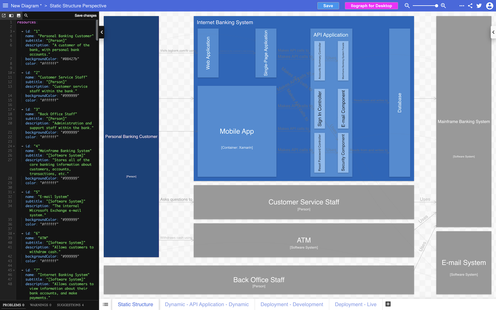

# Ilograph

The [IlographExporter](IlographExporter.java) class provides a way to export the software architecture model
to the YAML format used by [Ilograph](https://www.ilograph.com), which provides an interactive way to explore
a hierarchical dataset (which the C4 model is).

The resulting YAML will include:

- A perspective named `Static Structure` that reflects the static structural elements defined in your software architecture model.
- One perspective per dynamic view.
- One perspective per deployment view.

## Example usage

```
Workspace workspace = ...
IlographExporter exporter = new IlographExporter();
WorkspaceExport export = exporter.export(workspace);
```

If you'd like to see a demo:

1. Copy the Ilograph YAML from the [Structurizr DSL demo page - Big Bank plc example](https://structurizr.com/dsl?example=big-bank-plc&renderer=ilograph).
2. Head to [app.ilograph.com](https://app.ilograph.com) in your web browser.
3. Click "New diagram".
4. Replace the YAML in the textarea on the left of the page.
5. Click "Static Structure" at the bottom of the page.
6. Click around the diagram to navigate/explore the model.

